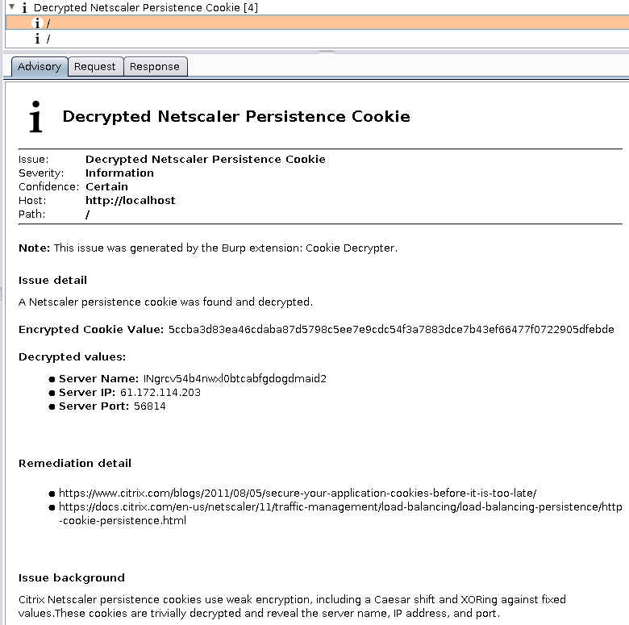
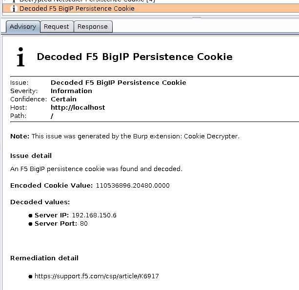

# Cookie Decrypter

A Burp Suite Professional extension for decrypting/decoding various types of cookies.

* Passive scanner checks create informational issues in Burp Suite
* Currently handles Netscaler, F5 BigIP, and Flask cookies
* Written in Python
* Requires Jython 2.7+
* Pull requests welcome!

### Todo

* ~~Add Flask session decrypt~~
* Add other cookie types

### Screenshots

